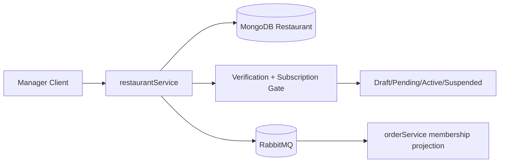
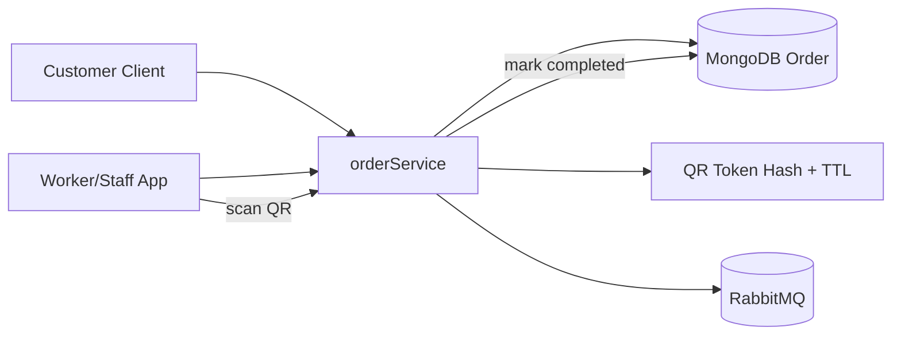
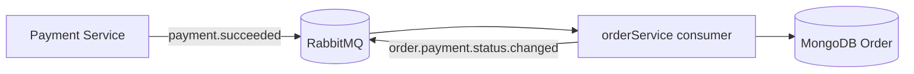

# Tasty Backend - Global Architecture & Role Actions

This document is the global backend overview for the current split architecture:

- `userService` (Identity + Auth)
- `restaurantService` (Restaurant + Menu)
- `orderService` (Orders + QR + Payment status updates)

---

## 1) What was implemented in this backend

### Core refactor completed

- Auth became identity-only and tenant-agnostic.
- Restaurant and Order responsibilities were split into separate services.
- Restaurant service no longer owns order APIs.
- Order service now owns order lifecycle, QR scan flow, and payment status updates.
- RabbitMQ event bridge was added between services.

### Current service boundaries

- `userService`
	- User registration/login/session refresh/logout
	- OAuth (Google/Facebook)
	- Email verification OTP flow
	- RS256 JWT issuance + JWKS endpoint

- `restaurantService`
	- Restaurant onboarding and lifecycle transitions
	- Subscription + verification gating
	- Staff assignment and restaurant membership mapping
	- Menu/category/item management
	- Public restaurant/menu read APIs
	- Emits restaurant membership events

- `orderService`
	- Create/list orders
	- Restaurant-scoped order read
	- QR token generation + one-time scan completion
	- Payment success event consumption and payment status update
	- Emits order domain events

---

## 2) Tech stack and infrastructure used

- Node.js + Express (all services)
- MongoDB + Mongoose
- Redis (auth/session/rate-limit and verification throttling)
- RabbitMQ (cross-service event communication)
- JWT RS256 + JWKS (`jose`)
- Zod validation
- Jest + Supertest tests
- Docker Compose per service

---

## 3) API ownership map (quick)

### userService

- Health + JWKS
- `POST /auth/register`
- `POST /auth/login`
- `POST /auth/refresh`
- `POST /auth/logout`
- `POST /auth/logout-all`
- `GET /auth/me`
- `POST /auth/email/start-verification`
- `POST /auth/email/verify`
- `GET /auth/oauth/:provider/start`
- `GET /auth/oauth/:provider/callback`
- `POST /auth/oauth/link/:provider`
- `DELETE /auth/oauth/unlink/:provider`
- `GET /auth/sessions`
- `DELETE /auth/sessions/:sessionId`

### restaurantService

- Public:
	- `GET /restaurants`
	- `GET /restaurants/:citySlug/:slug`
	- `GET /restaurants/:citySlug/:slug/menu`
- Manager/Superadmin:
	- create/update/read restaurants
	- request publish
	- assign staff
	- CRUD categories/items
	- set item availability/publish
- Superadmin only:
	- verify/unverify/reject
	- suspend/unsuspend
	- update subscription

### orderService

- `POST /v1/orders/me` create order
- `GET /v1/orders/me` current user orders
- `GET /v1/orders/restaurant/:restaurantId` restaurant orders (scoped)
- `GET /v1/orders/admin/all` all orders (superadmin)
- `POST /v1/orders/qr/scan` consume QR and complete order

---

## 4) Role-action matrix (what each role can do)

Global roles from JWT:

- `user`
- `worker`
- `staff`
- `manager`
- `superadmin`

Restaurant-local mapping exists in `restaurantService` as `RestaurantUser(userId, restaurantId, role)` where local roles are `OWNER | MANAGER | STAFF`.

### `user`

- Can register/login/refresh/logout in `userService`.
- Can verify own email.
- Can read public restaurants/menus in `restaurantService`.
- Can create own order and list own orders in `orderService`.
- Cannot access manager/admin restaurant APIs.

### `worker`

- Inherits authenticated user capabilities.
- In `restaurantService`, can manage menu items/categories only when global role check passes and restaurant membership access check passes on restaurant-scoped endpoints.
- In `orderService`, can read restaurant orders and scan QR (if authorized by role and restaurant access middleware for restaurant read route).

### `staff`

- Same operational access profile as `worker` in current route rules.
- Can manage menu resources on mapped restaurants.
- Can read restaurant orders and scan QR.

### `manager`

- Can create restaurants.
- Can update/request publish/view owned restaurant.
- Can assign staff to owned restaurant.
- Can manage menu for owned restaurant.
- Cannot run superadmin lifecycle actions (verify/suspend/subscription admin endpoints).
- Can read restaurant orders in `orderService` when mapped.

### `superadmin`

- Full manager-level capabilities.
- Can access superadmin-only restaurant lifecycle endpoints.
- Can list all orders in `orderService`.
- Bypasses restaurant membership checks where middleware allows superadmin bypass.

---

## 5) Event contracts (RabbitMQ)

### Published by `restaurantService`

- `restaurant.created`
- `restaurant.staff.assigned`
- `restaurant.staff.removed` (declared event contract)

### Consumed by `orderService`

- `restaurant.staff.assigned`
- `restaurant.staff.removed`
- `payment.succeeded`

### Published by `orderService`

- `order.created`
- `order.qr.generated`
- `order.payment.status.changed`

---

## 6) Lifecycle / cycle views

### A) Identity flow

```mermaid
flowchart LR
	Client[Client App] --> AuthAPI[userService API]
	AuthAPI --> MongoAuth[(MongoDB Auth)]
	AuthAPI --> Redis[(Redis)]
	AuthAPI --> SMTP[Email Sender]
	AuthAPI --> JWT[RS256 Access Token + Refresh Token]
	JWT --> Client
	OtherServices[restaurantService/orderService] --> JWKS[/.well-known/jwks.json]
	JWKS --> OtherServices
```

### B) Restaurant onboarding and publish lifecycle



### C) Order lifecycle (delivery/presence + QR)



### D) Payment status update flow



---

## 7) Analysis checklist: possible missing pieces / refactor candidates

Use this list to decide next refactor steps.

1. `orderService` test coverage is still minimal compared to other services (currently mostly smoke-level).
2. `payment.failed` and `payment.refunded` events are defined in constants but success path is the implemented consumer path.
3. `restaurant.staff.removed` event is part of contract but removal endpoint/flow should be verified end-to-end if you need full staff offboarding now.
4. `POST /v1/orders/me` is authenticated but not role-restricted beyond auth; if you want only customer role ordering, add role guard.
5. `POST /v1/orders/qr/scan` checks role but restaurant membership enforcement is token/order-based; add explicit membership enforcement if your policy requires it.

---

## 8) Demo-ready verification command set

Run all backend tests:

- `cd backend/userService && npm test`
- `cd backend/restaurantService && npm test`
- `cd backend/orderService && npm test`

If all pass, backend regression baseline is healthy for demo.

